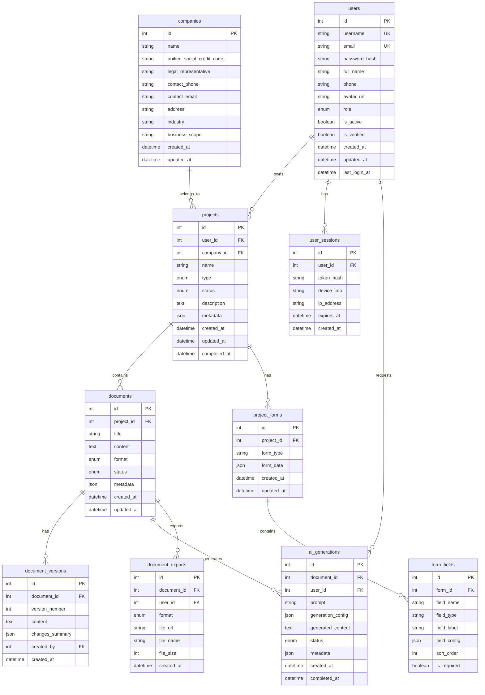

# 悦恩人机共写平台 - 数据库设计文档

## 1. 数据库概述

本文档描述了悦恩人机共写平台的数据库设计，包括表结构、关系、索引和约束。该平台主要用于生成环保应急预案和环评报告，支持AI辅助写作和人机协作。

## 2. 数据库ER图



## 3. 表结构详细定义

### 3.1 用户表 (users)

存储用户基本信息和认证数据。

| 字段名 | 数据类型 | 长度 | 是否为空 | 默认值 | 约束 | 说明 |
|--------|----------|------|----------|--------|------|------|
| id | INT | - | NOT NULL | - | PRIMARY KEY, AUTO_INCREMENT | 用户唯一标识 |
| username | VARCHAR | 50 | NOT NULL | - | UNIQUE | 用户名 |
| email | VARCHAR | 100 | NOT NULL | - | UNIQUE | 邮箱地址 |
| password_hash | VARCHAR | 255 | NOT NULL | - | - | 密码哈希值 |
| full_name | VARCHAR | 100 | NULL | - | - | 用户全名 |
| phone | VARCHAR | 20 | NULL | - | - | 手机号码 |
| avatar_url | VARCHAR | 500 | NULL | - | - | 头像URL |
| role | ENUM | - | NOT NULL | 'user' | 'user','admin' | 用户角色 |
| is_active | BOOLEAN | - | NOT NULL | TRUE | - | 账户是否激活 |
| is_verified | BOOLEAN | - | NOT NULL | FALSE | - | 邮箱是否验证 |
| created_at | DATETIME | - | NOT NULL | CURRENT_TIMESTAMP | - | 创建时间 |
| updated_at | DATETIME | - | NOT NULL | CURRENT_TIMESTAMP ON UPDATE | - | 更新时间 |
| last_login_at | DATETIME | - | NULL | - | - | 最后登录时间 |

### 3.2 用户会话表 (user_sessions)

存储用户登录会话信息，用于JWT令牌管理。

| 字段名 | 数据类型 | 长度 | 是否为空 | 默认值 | 约束 | 说明 |
|--------|----------|------|----------|--------|------|------|
| id | INT | - | NOT NULL | - | PRIMARY KEY, AUTO_INCREMENT | 会话唯一标识 |
| user_id | INT | - | NOT NULL | - | FOREIGN KEY (users.id) | 用户ID |
| token_hash | VARCHAR | 255 | NOT NULL | - | - | 令牌哈希值 |
| device_info | TEXT | - | NULL | - | - | 设备信息 |
| ip_address | VARCHAR | 45 | NULL | - | - | IP地址 |
| expires_at | DATETIME | - | NOT NULL | - | - | 过期时间 |
| created_at | DATETIME | - | NOT NULL | CURRENT_TIMESTAMP | - | 创建时间 |

### 3.3 企业信息表 (companies)

存储企业基本信息。

| 字段名 | 数据类型 | 长度 | 是否为空 | 默认值 | 约束 | 说明 |
|--------|----------|------|----------|--------|------|------|
| id | INT | - | NOT NULL | - | PRIMARY KEY, AUTO_INCREMENT | 企业唯一标识 |
| name | VARCHAR | 200 | NOT NULL | - | - | 企业名称 |
| unified_social_credit_code | VARCHAR | 18 | NULL | - | UNIQUE | 统一社会信用代码 |
| legal_representative | VARCHAR | 100 | NULL | - | - | 法定代表人 |
| contact_phone | VARCHAR | 20 | NULL | - | - | 联系电话 |
| contact_email | VARCHAR | 100 | NULL | - | - | 联系邮箱 |
| address | TEXT | - | NULL | - | - | 企业地址 |
| industry | VARCHAR | 100 | NULL | - | - | 所属行业 |
| business_scope | TEXT | - | NULL | - | - | 经营范围 |
| created_at | DATETIME | - | NOT NULL | CURRENT_TIMESTAMP | - | 创建时间 |
| updated_at | DATETIME | - | NOT NULL | CURRENT_TIMESTAMP ON UPDATE | - | 更新时间 |

### 3.4 项目表 (projects)

存储应急预案和环评报告项目信息。

| 字段名 | 数据类型 | 长度 | 是否为空 | 默认值 | 约束 | 说明 |
|--------|----------|------|----------|--------|------|------|
| id | INT | - | NOT NULL | - | PRIMARY KEY, AUTO_INCREMENT | 项目唯一标识 |
| user_id | INT | - | NOT NULL | - | FOREIGN KEY (users.id) | 所属用户ID |
| company_id | INT | - | NULL | - | FOREIGN KEY (companies.id) | 关联企业ID |
| name | VARCHAR | 200 | NOT NULL | - | - | 项目名称 |
| type | ENUM | - | NOT NULL | - | 'emergency_plan','environmental_assessment' | 项目类型 |
| status | ENUM | - | NOT NULL | 'draft' | 'draft','generating','reviewing','completed','archived' | 项目状态 |
| description | TEXT | - | NULL | - | - | 项目描述 |
| metadata | JSON | - | NULL | - | - | 项目元数据 |
| created_at | DATETIME | - | NOT NULL | CURRENT_TIMESTAMP | - | 创建时间 |
| updated_at | DATETIME | - | NOT NULL | CURRENT_TIMESTAMP ON UPDATE | - | 更新时间 |
| completed_at | DATETIME | - | NULL | - | - | 完成时间 |

### 3.5 项目表单表 (project_forms)

存储项目相关的表单数据。

| 字段名 | 数据类型 | 长度 | 是否为空 | 默认值 | 约束 | 说明 |
|--------|----------|------|----------|--------|------|------|
| id | INT | - | NOT NULL | - | PRIMARY KEY, AUTO_INCREMENT | 表单唯一标识 |
| project_id | INT | - | NOT NULL | - | FOREIGN KEY (projects.id) | 所属项目ID |
| form_type | VARCHAR | 50 | NOT NULL | - | - | 表单类型 |
| form_data | JSON | - | NOT NULL | - | - | 表单数据 |
| created_at | DATETIME | - | NOT NULL | CURRENT_TIMESTAMP | - | 创建时间 |
| updated_at | DATETIME | - | NOT NULL | CURRENT_TIMESTAMP ON UPDATE | - | 更新时间 |

### 3.6 表单字段表 (form_fields)

存储表单字段定义。

| 字段名 | 数据类型 | 长度 | 是否为空 | 默认值 | 约束 | 说明 |
|--------|----------|------|----------|--------|------|------|
| id | INT | - | NOT NULL | - | PRIMARY KEY, AUTO_INCREMENT | 字段唯一标识 |
| form_id | INT | - | NOT NULL | - | FOREIGN KEY (project_forms.id) | 所属表单ID |
| field_name | VARCHAR | 100 | NOT NULL | - | - | 字段名称 |
| field_type | VARCHAR | 50 | NOT NULL | - | - | 字段类型 |
| field_label | VARCHAR | 200 | NOT NULL | - | - | 字段标签 |
| field_config | JSON | - | NULL | - | - | 字段配置 |
| sort_order | INT | - | NOT NULL | 0 | - | 排序顺序 |
| is_required | BOOLEAN | - | NOT NULL | FALSE | - | 是否必填 |

### 3.7 文档表 (documents)

存储生成的文档内容和元数据。

| 字段名 | 数据类型 | 长度 | 是否为空 | 默认值 | 约束 | 说明 |
|--------|----------|------|----------|--------|------|------|
| id | INT | - | NOT NULL | - | PRIMARY KEY, AUTO_INCREMENT | 文档唯一标识 |
| project_id | INT | - | NOT NULL | - | FOREIGN KEY (projects.id) | 所属项目ID |
| title | VARCHAR | 200 | NOT NULL | - | - | 文档标题 |
| content | LONGTEXT | - | NULL | - | - | 文档内容 |
| format | ENUM | - | NOT NULL | 'markdown' | 'markdown','html','plain_text' | 文档格式 |
| status | ENUM | - | NOT NULL | 'draft' | 'draft','reviewing','approved','published' | 文档状态 |
| metadata | JSON | - | NULL | - | - | 文档元数据 |
| created_at | DATETIME | - | NOT NULL | CURRENT_TIMESTAMP | - | 创建时间 |
| updated_at | DATETIME | - | NOT NULL | CURRENT_TIMESTAMP ON UPDATE | - | 更新时间 |

### 3.8 文档版本表 (document_versions)

管理文档版本历史。

| 字段名 | 数据类型 | 长度 | 是否为空 | 默认值 | 约束 | 说明 |
|--------|----------|------|----------|--------|------|------|
| id | INT | - | NOT NULL | - | PRIMARY KEY, AUTO_INCREMENT | 版本唯一标识 |
| document_id | INT | - | NOT NULL | - | FOREIGN KEY (documents.id) | 文档ID |
| version_number | INT | - | NOT NULL | - | - | 版本号 |
| content | LONGTEXT | - | NOT NULL | - | - | 版本内容 |
| changes_summary | JSON | - | NULL | - | - | 变更摘要 |
| created_by | INT | - | NOT NULL | - | FOREIGN KEY (users.id) | 创建者ID |
| created_at | DATETIME | - | NOT NULL | CURRENT_TIMESTAMP | - | 创建时间 |

### 3.9 AI生成记录表 (ai_generations)

记录AI生成过程和结果。

| 字段名 | 数据类型 | 长度 | 是否为空 | 默认值 | 约束 | 说明 |
|--------|----------|------|----------|--------|------|------|
| id | INT | - | NOT NULL | - | PRIMARY KEY, AUTO_INCREMENT | 生成记录唯一标识 |
| document_id | INT | - | NOT NULL | - | FOREIGN KEY (documents.id) | 文档ID |
| user_id | INT | - | NOT NULL | - | FOREIGN KEY (users.id) | 用户ID |
| prompt | TEXT | - | NOT NULL | - | - | 生成提示词 |
| generation_config | JSON | - | NULL | - | - | 生成配置 |
| generated_content | LONGTEXT | - | NULL | - | - | 生成内容 |
| status | ENUM | - | NOT NULL | 'pending' | 'pending','processing','completed','failed' | 生成状态 |
| metadata | JSON | - | NULL | - | - | 元数据 |
| created_at | DATETIME | - | NOT NULL | CURRENT_TIMESTAMP | - | 创建时间 |
| completed_at | DATETIME | - | NULL | - | - | 完成时间 |

### 3.10 文档导出表 (document_exports)

记录文档导出历史。

| 字段名 | 数据类型 | 长度 | 是否为空 | 默认值 | 约束 | 说明 |
|--------|----------|------|----------|--------|------|------|
| id | INT | - | NOT NULL | - | PRIMARY KEY, AUTO_INCREMENT | 导出记录唯一标识 |
| document_id | INT | - | NOT NULL | - | FOREIGN KEY (documents.id) | 文档ID |
| user_id | INT | - | NOT NULL | - | FOREIGN KEY (users.id) | 用户ID |
| format | ENUM | - | NOT NULL | - | 'pdf','word','html','markdown' | 导出格式 |
| file_url | VARCHAR | 500 | NULL | - | - | 文件URL |
| file_name | VARCHAR | 255 | NULL | - | - | 文件名 |
| file_size | INT | - | NULL | - | - | 文件大小(字节) |
| created_at | DATETIME | - | NOT NULL | CURRENT_TIMESTAMP | - | 创建时间 |

## 4. 索引设计

### 4.1 主要索引

```sql
-- 用户表索引
CREATE INDEX idx_users_email ON users(email);
CREATE INDEX idx_users_username ON users(username);
CREATE INDEX idx_users_is_active ON users(is_active);

-- 项目表索引
CREATE INDEX idx_projects_user_id ON projects(user_id);
CREATE INDEX idx_projects_company_id ON projects(company_id);
CREATE INDEX idx_projects_type ON projects(type);
CREATE INDEX idx_projects_status ON projects(status);
CREATE INDEX idx_projects_created_at ON projects(created_at);

-- 文档表索引
CREATE INDEX idx_documents_project_id ON documents(project_id);
CREATE INDEX idx_documents_status ON documents(status);
CREATE INDEX idx_documents_created_at ON documents(created_at);

-- 文档版本表索引
CREATE INDEX idx_document_versions_document_id ON document_versions(document_id);
CREATE INDEX idx_document_versions_version_number ON document_versions(document_id, version_number);

-- AI生成记录表索引
CREATE INDEX idx_ai_generations_document_id ON ai_generations(document_id);
CREATE INDEX idx_ai_generations_user_id ON ai_generations(user_id);
CREATE INDEX idx_ai_generations_status ON ai_generations(status);
CREATE INDEX idx_ai_generations_created_at ON ai_generations(created_at);

-- 用户会话表索引
CREATE INDEX idx_user_sessions_user_id ON user_sessions(user_id);
CREATE INDEX idx_user_sessions_token_hash ON user_sessions(token_hash);
CREATE INDEX idx_user_sessions_expires_at ON user_sessions(expires_at);

-- 企业信息表索引
CREATE INDEX idx_companies_name ON companies(name);
CREATE INDEX idx_companies_unified_social_credit_code ON companies(unified_social_credit_code);
```

### 4.2 复合索引

```sql
-- 项目查询优化
CREATE INDEX idx_projects_user_status ON projects(user_id, status);
CREATE INDEX idx_projects_type_status ON projects(type, status);

-- 文档查询优化
CREATE INDEX idx_documents_project_status ON documents(project_id, status);

-- AI生成记录查询优化
CREATE INDEX idx_ai_generations_document_status ON ai_generations(document_id, status);
CREATE INDEX idx_ai_generations_user_created ON ai_generations(user_id, created_at);
```

## 5. 数据库约束

### 5.1 外键约束

```sql
-- 用户会话表外键
ALTER TABLE user_sessions ADD CONSTRAINT fk_user_sessions_user_id 
    FOREIGN KEY (user_id) REFERENCES users(id) ON DELETE CASCADE;

-- 项目表外键
ALTER TABLE projects ADD CONSTRAINT fk_projects_user_id 
    FOREIGN KEY (user_id) REFERENCES users(id) ON DELETE CASCADE;
ALTER TABLE projects ADD CONSTRAINT fk_projects_company_id 
    FOREIGN KEY (company_id) REFERENCES companies(id) ON DELETE SET NULL;

-- 项目表单表外键
ALTER TABLE project_forms ADD CONSTRAINT fk_project_forms_project_id 
    FOREIGN KEY (project_id) REFERENCES projects(id) ON DELETE CASCADE;

-- 表单字段表外键
ALTER TABLE form_fields ADD CONSTRAINT fk_form_fields_form_id 
    FOREIGN KEY (form_id) REFERENCES project_forms(id) ON DELETE CASCADE;

-- 文档表外键
ALTER TABLE documents ADD CONSTRAINT fk_documents_project_id 
    FOREIGN KEY (project_id) REFERENCES projects(id) ON DELETE CASCADE;

-- 文档版本表外键
ALTER TABLE document_versions ADD CONSTRAINT fk_document_versions_document_id 
    FOREIGN KEY (document_id) REFERENCES documents(id) ON DELETE CASCADE;
ALTER TABLE document_versions ADD CONSTRAINT fk_document_versions_created_by 
    FOREIGN KEY (created_by) REFERENCES users(id) ON DELETE CASCADE;

-- AI生成记录表外键
ALTER TABLE ai_generations ADD CONSTRAINT fk_ai_generations_document_id 
    FOREIGN KEY (document_id) REFERENCES documents(id) ON DELETE CASCADE;
ALTER TABLE ai_generations ADD CONSTRAINT fk_ai_generations_user_id 
    FOREIGN KEY (user_id) REFERENCES users(id) ON DELETE CASCADE;

-- 文档导出表外键
ALTER TABLE document_exports ADD CONSTRAINT fk_document_exports_document_id 
    FOREIGN KEY (document_id) REFERENCES documents(id) ON DELETE CASCADE;
ALTER TABLE document_exports ADD CONSTRAINT fk_document_exports_user_id 
    FOREIGN KEY (user_id) REFERENCES users(id) ON DELETE CASCADE;
```

### 5.2 检查约束

```sql
-- 用户表检查约束
ALTER TABLE users ADD CONSTRAINT chk_users_role 
    CHECK (role IN ('user', 'admin'));

-- 项目表检查约束
ALTER TABLE projects ADD CONSTRAINT chk_projects_type 
    CHECK (type IN ('emergency_plan', 'environmental_assessment'));
ALTER TABLE projects ADD CONSTRAINT chk_projects_status 
    CHECK (status IN ('draft', 'generating', 'reviewing', 'completed', 'archived'));

-- 文档表检查约束
ALTER TABLE documents ADD CONSTRAINT chk_documents_format 
    CHECK (format IN ('markdown', 'html', 'plain_text'));
ALTER TABLE documents ADD CONSTRAINT chk_documents_status 
    CHECK (status IN ('draft', 'reviewing', 'approved', 'published'));

-- AI生成记录表检查约束
ALTER TABLE ai_generations ADD CONSTRAINT chk_ai_generations_status 
    CHECK (status IN ('pending', 'processing', 'completed', 'failed'));

-- 文档导出表检查约束
ALTER TABLE document_exports ADD CONSTRAINT chk_document_exports_format 
    CHECK (format IN ('pdf', 'word', 'html', 'markdown'));
```

## 6. 数据库性能优化建议

1. **分区策略**：对于大数据量表（如ai_generations、document_versions），可按时间进行分区
2. **读写分离**：配置主从复制，读操作使用从库
3. **缓存策略**：使用Redis缓存热点数据，如用户信息、项目列表等
4. **连接池**：配置数据库连接池，提高并发性能
5. **慢查询优化**：定期分析慢查询日志，优化SQL语句

## 7. 数据安全和隐私保护

1. **数据加密**：敏感数据（如密码）使用bcrypt加密存储
2. **访问控制**：基于角色的访问控制（RBAC）
3. **数据脱敏**：日志中不记录敏感信息
4. **备份策略**：定期备份数据库，确保数据安全
5. **审计日志**：记录关键操作日志，便于追踪