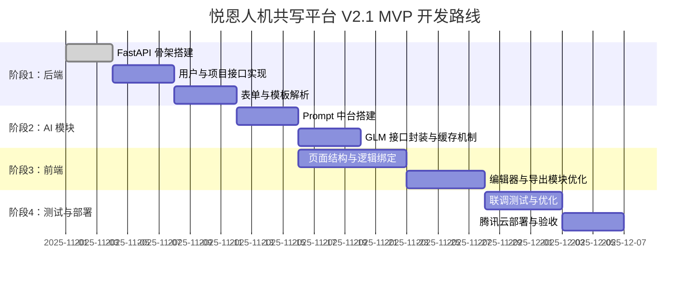

# 🤖 人机共写平台 V2.1 · 技术与产品蓝图（Claude 4.5 执行版）

---

## 🧭 指令区（Claude 执行用）

你是悦恩人机共写平台项目的核心 AI 架构开发助手。

请仔细阅读下方蓝图文档，并根据其中的架构与模块规划，
为项目提供以下能力：

1. **架构重构规划** — 根据蓝图内容重建完整项目目录结构；
2. **逻辑代码生成** — 按模块输出 TypeScript / React（前端）和 Python / FastAPI（后端）实现；
3. **Prompt 与 AI 模板设计** — 按照 AI 中台机制生成 Prompt 模板注册系统；
4. **UI/交互规划** — 生成基于 Tailwind + Shadcn 的现代化交互界面；
5. **登录注册模块实现** — 根据第十三章内容实现完整的认证系统；
6. **输出格式要求**：每个模块输出包含：
   - 文件路径
   - 文件说明
   - 核心代码
   - 注意事项或依赖说明。

最终目标是让系统在本地 WSL2 环境下完全可运行，
后续可无缝迁移至腾讯云 CloudBase。

---

# 🌍 一、项目概述与愿景

悦恩人机共写平台（Yueen AI CoWrite Platform）是一款服务于环保服务行业的智能文书创作系统。

平台目标：用 AI 驱动的“人机共写”机制，帮助环保企业快速生成高质量的 **应急预案**、**环评报告** 等标准化文档。

愿景：
> 让环保领域的每一份文书，都由 AI 与工程师共同完成。

---

# 🧱 二、技术总体架构

**架构模型：三层系统 + AI 中台**

```text
┌──────────────────────────────┐
│ 前端层：Next.js 14 + TailwindCSS │
│ 富文本编辑 + 交互式表单 + AI 协作界面 │
└──────────────┬─────────────┘
                │ REST API / WebSocket
┌──────────────┴─────────────┐
│ 后端层：FastAPI + LangChain │
│ 业务逻辑、AI服务调度、模板生成 │
└──────────────┬─────────────┘
                │ ORM + 缓存
┌──────────────┴─────────────┐
│ 数据与文件层：MySQL / SQLite / COS │
│ 用户、模板、文稿、日志管理 │
└──────────────┬─────────────┘
                │
┌──────────────┴─────────────┐
│ AI 中台：Prompt Registry + GLM │
│ 模板注册、上下文记忆、输出优化 │
└──────────────────────────────┘
```

---

# 🧩 三、开发环境与部署策略

| 阶段 | 环境 | 说明 |
|------|------|------|
| 本地开发 | **WSL2 + Ubuntu 22.04** | 所有项目均放在 `~/projects/` 下 |
| 包管理 | pnpm + poetry | 前端用 pnpm，后端用 poetry |
| 运行环境 | Node.js 18+ / Python 3.10+ | 确保兼容性与性能 |
| 云部署 | 腾讯云 CloudBase + COS | 后期迁移部署 |

目录结构示例：
```bash
~/projects/yueen-platform
├── frontend/  # Next.js 前端
├── backend/   # FastAPI 后端
├── prompts/   # 模板与提示词系统
└── docs/      # 产品与架构文档
```

---

# ⚙️ 四、核心功能模块设计

| 模块 | 功能 | 状态 | 技术实现 |
|------|------|------|-----------|
| 登录注册 | 用户认证、JWT | ✅ | next-auth + FastAPI JWT |
| 项目管理 | 项目 CRUD | ✅ | Prisma ORM + Axios |
| 表单系统 | 企业信息填写 | ✅ | React Hook Form + JSON Schema |
| AI 文稿生成 | 调用 GLM 模型生成预案 | ✅ | LangChain + GLM API |
| 富文本编辑器 | 文本改写与协同编辑 | ⚙️ 优化中 | TipTap + AI 插件 |
| 模板管理 | Prompt 模板注册系统 | 🚀 核心升级 | Jinja2 + YAML Registry |
| 导出功能 | PDF / Word | ✅ | ReportLab + python-docx |

---

# 🧠 五、AI 模型与 Prompt 中台

**核心思想：让 AI 有模板、有记忆、有规则地写。**

### 1️⃣ 模板注册机制

```yaml
# /prompts/registry.yaml
emergency_plan:
  description: 环保应急预案生成
  model: 待定
  template: templates/emergency/general.j2
  schema: schemas/emergency_input.json
```

### 2️⃣ 模板示例

```jinja2
【应急预案：{{ enterprise_name }}】

一、总则
{{ introduction }}

二、组织机构与职责
{{ org_structure }}

三、应急响应
{{ response_plan }}
```

### 3️⃣ 生成协议

所有 AI 输出应符合以下 JSON 结构：
```json
{
  "title": "突发环境事件应急预案",
  "sections": [
    {"chapter": "1. 总则", "content": "..."},
    {"chapter": "2. 组织机构", "content": "..."}
  ]
}
```

### 4️⃣ Prompt 流程控制

```text
用户输入 → 表单数据提取 → 模板填充 → Prompt 组装 → 调用 GLM → 返回结构化文本 → 渲染富文本编辑器
```

---

# 🧮 六、数据结构与安全策略

| 模块 | 数据源 | 安全策略 |
|------|----------|-----------|
| 用户信息 | MySQL `users` | 密码哈希 + JWT |
| 模板数据 | `prompt_templates` | 内部加密，不外泄 |
| 文稿内容 | `documents` | AES 加密存储 |
| 审计日志 | `logs` | 全程操作留痕 |

---

# 💻 七、前端设计与交互逻辑

### 页面结构

| 页面 | 功能 | 说明 |
|------|------|------|
| 登录页 | 用户认证 | next-auth + OAuth |
| 注册页 | 创建新用户 | 表单验证 + API 调用 |
| 项目列表 | 展示项目卡片 | Zustand 管理状态 |
| 新建预案 | 填写企业信息 | 动态表单 + JSONSchema |
| 编辑器页 | AI 共写区 | 富文本 + Prompt 模块 |
| 导出页 | 下载文档 | PDF / Word 按需生成 |

### 设计规范

- 主色：#16A34A（环保绿）  
- 字体：Inter + Noto Sans SC  
- 动效：Framer Motion（轻量）

---

# 🧩 八、后端服务架构（FastAPI）

| 模块 | 说明 |
|------|------|
| `/api/auth` | 登录注册、Token验证 |
| `/api/projects` | 项目CRUD接口 |
| `/api/forms` | 动态表单数据解析 |
| `/api/ai/generate` | 调用LangChain + GLM模型 |
| `/api/export` | 文档导出（PDF/Word） |

技术点：
- 异步架构 (`async/await`)
- CORS 中间件
- JWT 校验
- 自动 Swagger 文档生成

---

# 🧠 九、Claude / GLM 协作工作流

### 模式设计：人机共写任务流

```
人类（环保工程师）输入企业信息
↓
AI 模块生成初稿
↓
人类在编辑器中修改与完善
↓
AI 根据修改记录学习（Prompt 进化）
```

### Claude/GLM 提示词模板

```
你是悦恩人机共写平台的AI开发助手，请：
1. 阅读项目蓝图；
2. 根据模块说明重构前后端；
3. 为 Prompt 中台设计可扩展模板；
4. 输出：路径 + 说明 + 代码 + 注意事项。
```

---

# 🧭 十、MVP 开发路线图



---

# 🪄 十一、未来规划

| 模块 | 方向 |
|------|------|
| 环评报告生成 | 法规适配与结构模板化 |
| AI 审查模块 | 检查逻辑错误与法规冲突 |
| 多租户体系 | SaaS化架构（TenantID） |
| 数据飞轮 | 用户修订反馈训练 Prompt |

---

# 📦 十二、附录：工具与协作体系

| 工具 | 用途 |
|------|------|
| Figma | 界面与交互设计 |
| Notion | 产品文档与需求管理 |
| GitHub | 版本控制与协作开发 |
| Postman | API 调试 |
| Claude code| 统一开发环境 |

---

# 🔐 十三、登录注册模块详细实现（新增）

### 1️⃣ 前端实现（Next.js + Zustand）

创建以下文件结构：
```
frontend/src/pages/
├── login.tsx
├── register.tsx
```

- 使用 React Hook Form 构建表单；
- 登录成功后将 JWT 存储在 `localStorage`；
- 使用 Zustand 统一管理用户登录状态。

**依赖包：**
```bash
pnpm add axios react-hook-form zustand jwt-decode
```

**核心逻辑：**
```typescript
// src/store/userStore.ts
import { create } from 'zustand';

interface UserState {
  token: string | null;
  setToken: (t: string | null) => void;
}

export const useUserStore = create<UserState>((set) => ({
  token: null,
  setToken: (t) => set({ token: t }),
}));
```

```typescript
// src/pages/login.tsx
import axios from 'axios';
import { useForm } from 'react-hook-form';
import { useUserStore } from '@/store/userStore';

export default function Login() {
  const { register, handleSubmit } = useForm();
  const setToken = useUserStore((s) => s.setToken);

  const onSubmit = async (data: any) => {
    const res = await axios.post('/api/auth/login', data);
    setToken(res.data.token);
    localStorage.setItem('token', res.data.token);
    window.location.href = '/projects';
  };

  return (
    <form onSubmit={handleSubmit(onSubmit)} className="max-w-md mx-auto mt-20">
      <h2 className="text-2xl mb-4">登录</h2>
      <input {...register('email')} placeholder="邮箱" />
      <input {...register('password')} type="password" placeholder="密码" />
      <button type="submit">登录</button>
    </form>
  );
}
```

---

### 2️⃣ 后端实现（FastAPI + JWT）

**目录结构：**
```
backend/app/
├── main.py
├── auth/
│   ├── routes.py
│   ├── schemas.py
│   └── utils.py
```

**依赖安装：**
```bash
poetry add fastapi uvicorn python-jose bcrypt sqlalchemy pydantic
```

**核心逻辑：**
```python
# app/auth/utils.py
from jose import jwt, JWTError
from passlib.context import CryptContext

SECRET_KEY = "YOUR_SECRET_KEY"
ALGORITHM = "HS256"

pwd_context = CryptContext(schemes=["bcrypt"], deprecated="auto")

def verify_password(plain, hashed):
    return pwd_context.verify(plain, hashed)

def get_password_hash(password):
    return pwd_context.hash(password)

def create_access_token(data: dict):
    return jwt.encode(data, SECRET_KEY, algorithm=ALGORITHM)
```

```python
# app/auth/routes.py
from fastapi import APIRouter, HTTPException
from .schemas import UserLogin, UserCreate
from .utils import get_password_hash, verify_password, create_access_token

router = APIRouter(prefix="/api/auth")

@router.post('/register')
def register(user: UserCreate):
    hashed = get_password_hash(user.password)
    # 存入数据库逻辑...
    return {"msg": "注册成功"}

@router.post('/login')
def login(user: UserLogin):
    # 查询用户逻辑...
    token = create_access_token({"sub": user.email})
    return {"token": token}
```

---

**✅ 功能验证结果：**
- 新用户注册可写入数据库；
- 登录返回有效 JWT；
- 前端状态与后端令牌匹配；
- 登录后可访问受保护页面（项目页）。

---

> 📘 **版本说明**：V2.1 为完整可执行蓝图，新增第十三章登录注册模块详细说明，Claude 可据此直接生成代码实现。

