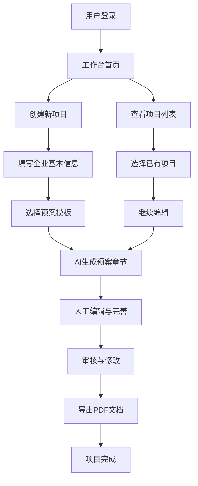
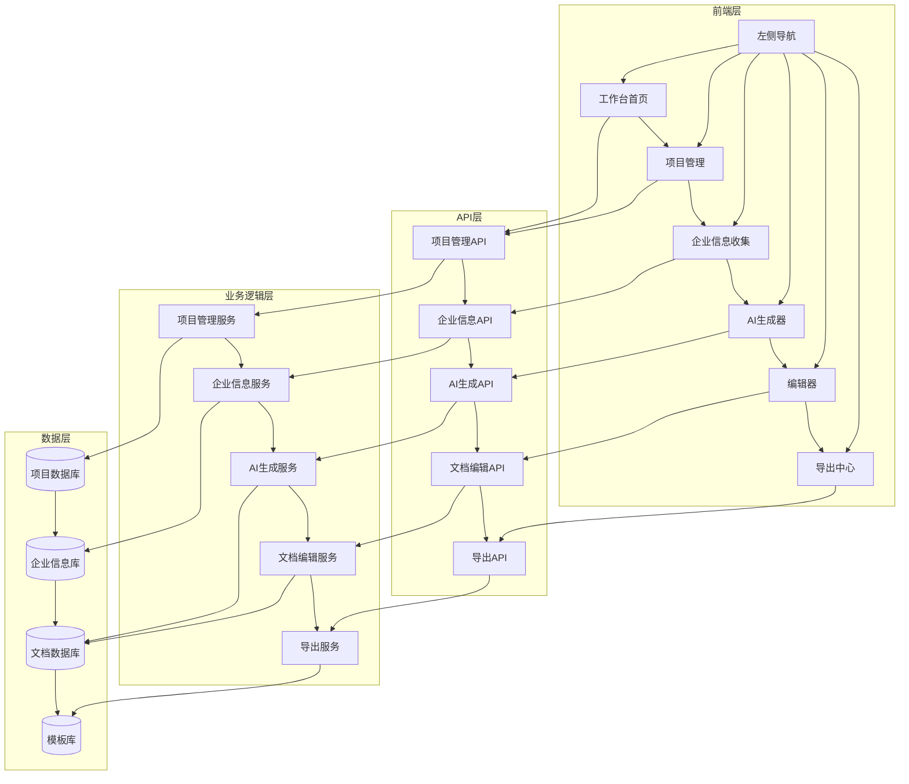
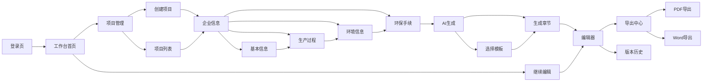
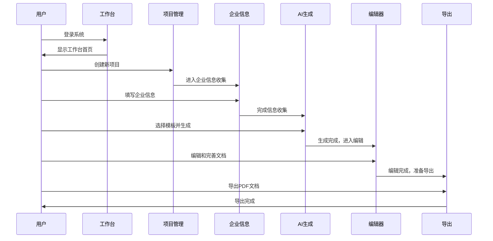

# 应急预案人机共写平台 - 架构设计文档

## 一、当前系统问题分析

### 1.1 主要问题

1. **工作台结构混乱**
   - 用户进入系统后不知道从何开始
   - 功能入口分散，缺乏清晰的引导流程
   - 没有明确的项目创建到完成的路径指引

2. **菜单结构不合理**
   - 菜单项过多且分类不清晰
   - 功能层级混乱，用户容易迷路
   - 缺乏基于业务流程的导航设计

3. **页面功能职责不明确**
   - 企业信息收集与项目管理分离
   - AI生成功能与编辑器功能割裂
   - 缺乏统一的工作流程管理

4. **用户体验问题**
   - 缺乏进度提示和状态管理
   - 操作步骤不连贯，需要用户在不同页面间频繁切换
   - 没有清晰的任务引导和完成标准

### 1.2 用户痛点

1. **新用户上手困难**：不知道如何开始创建应急预案
2. **流程不清晰**：不理解从企业信息收集到预案生成的完整流程
3. **功能分散**：需要在多个页面间切换才能完成一个任务
4. **状态不明确**：不清楚当前项目处于哪个阶段，下一步该做什么

## 二、核心业务流程设计

### 2.1 整体系统核心流程



### 2.2 项目主流程步骤图

#### Step 1: 创建项目
- **功能**: 创建新的应急预案项目
- **输入**: 项目名称、项目描述
- **输出**: 项目ID，进入企业信息填写
- **页面**: 项目创建页

#### Step 2: 填写企业基本信息
- **功能**: 收集企业基本信息，为AI生成提供数据
- **输入**: 企业名称、地址、行业、联系方式等
- **输出**: 企业信息数据结构
- **页面**: 企业信息收集页

#### Step 3: 填写生产过程信息
- **功能**: 收集企业生产过程相关信息
- **输入**: 主要产品、生产工艺、生产设施等
- **输出**: 生产过程数据
- **页面**: 企业信息收集页 - 生产过程部分

#### Step 4: 填写环境信息
- **功能**: 收集企业周边环境信息
- **输入**: 地理位置、周边环境、气象水文等
- **输出**: 环境信息数据
- **页面**: 企业信息收集页 - 环境信息部分

#### Step 5: 填写环保手续
- **功能**: 收集企业环保相关手续信息
- **输入**: 环评批复、验收文件、排污许可证等
- **输出**: 环保手续数据
- **页面**: 企业信息收集页 - 环保手续部分

#### Step 6: 进入预案生成器（AI编辑器）
- **功能**: 基于收集的信息生成应急预案
- **输入**: 企业信息数据、选择的模板
- **输出**: 预案初稿
- **页面**: AI生成器页

#### Step 7: 人工修改
- **功能**: 人工编辑和完善AI生成的预案
- **输入**: 预案初稿
- **输出**: 完善的预案文档
- **页面**: 编辑器页

#### Step 8: 导出预案
- **功能**: 将完成的预案导出为PDF文档
- **输入**: 最终预案文档
- **输出**: PDF文件
- **页面**: 导出页

## 三、重新设计的左侧菜单结构

### 3.1 菜单设计原则

1. **简化层级**: 最多两级菜单，避免复杂嵌套
2. **业务导向**: 按照应急预案创建流程组织菜单
3. **状态感知**: 根据项目状态显示相应菜单项
4. **功能聚合**: 相关功能集中在同一菜单项下

### 3.2 新菜单结构

```
📋 工作台
├── 🏠 首页 (工作台概览)
├── 📂 项目管理
│   ├── 创建新项目
│   ├── 我的项目
│   └── 项目模板
└── 📊 数据中心
    ├── 企业信息库
    └── 预案模板库

📝 预案编制 (仅在有活跃项目时显示)
├── 📋 企业信息
│   ├── 基本信息
│   ├── 生产过程
│   ├── 环境信息
│   └── 环保手续
├── 🤖 AI生成
│   ├── 选择模板
│   ├── 生成章节
│   └── 生成历史
├── ✏️ 编辑器
│   ├── 文档编辑
│   ├── 版本历史
│   └── 协作评论
└── 📤 导出中心
    ├── PDF导出
    ├── Word导出
    └── 导出历史

⚙️ 系统设置
├── 👤 个人资料
├── 🔧 系统配置
└── 📖 使用帮助
```

## 四、重新设计的工作台首页

### 4.1 设计目标

1. **清晰引导**: 用户一眼就能知道下一步该做什么
2. **状态展示**: 明确显示当前项目和任务状态
3. **快速入口**: 提供常用功能的快速访问
4. **进度提示**: 显示项目完成进度

### 4.2 工作台首页内容

```
┌─────────────────────────────────────────────────────────────┐
│ 悦恩应急预案人机共写平台                                    │
├─────────────────────────────────────────────────────────────┤
│ 👋 欢迎，[用户名]                                          │
│                                                         │
│ 📊 我的项目概览                                           │
│ ┌─────────────┬─────────────┬─────────────┬─────────────┐ │
│ │ 进行中: 2   │ 已完成: 5   │ 本月创建: 3 │ 总计: 7     │ │
│ └─────────────┴─────────────┴─────────────┴─────────────┘ │
│                                                         │
│ 🚀 快速开始                                               │
│ ┌─────────────────────────────────────────────────────┐ │
│ │ [🆕 创建新项目]                                      │ │
│ │ ── 从零开始创建一个新的应急预案项目                    │ │
│ │                                                     │ │
│ │ [📋 继续编辑]                                        │ │
│ │ ── 继续编辑未完成的项目: "XX化工应急预案"             │ │
│ │                                                     │ │
│ │ [📂 使用模板]                                        │ │
│ │ ── 基于模板快速创建预案                               │ │
│ └─────────────────────────────────────────────────────┘ │
│                                                         │
│ 📈 最近项目                                               │
│ ┌─────────────────────────────────────────────────────┐ │
│ │ 📄 XX化工应急预案        [编辑] [继续] [完成 75%]     │ │
│ │ 📄 YY公司环境应急预案    [编辑] [继续] [完成 45%]     │ │
│ │ 📄 ZZ集团安全预案        [查看] [导出] [已完成]       │ │
│ └─────────────────────────────────────────────────────┘ │
│                                                         │
│ 📚 学习资源                                               │
│ ┌─────────────────────────────────────────────────────┐ │
│ │ 📖 使用指南    🎥 视频教程    ❓ 常见问题            │ │
│ └─────────────────────────────────────────────────────┘ │
└─────────────────────────────────────────────────────────────┘
```

## 五、各页面功能定义

### 5.1 项目管理页

**功能职责**:
- 创建新项目
- 显示项目列表（进行中、已完成、已归档）
- 项目状态管理
- 项目搜索和筛选
- 项目删除和归档

**核心内容**:
- 项目创建表单
- 项目卡片列表（显示项目名称、状态、进度、最后修改时间）
- 项目操作按钮（编辑、继续、删除、归档）

### 5.2 企业信息页

**功能职责**:
- 分步骤收集企业信息
- 信息验证和完整性检查
- 信息保存和编辑
- 信息预览

**核心内容**:
- 步骤导航（基本信息、生产过程、环境信息、环保手续）
- 分步表单（每步一个表单区域）
- 进度指示器
- 保存和继续按钮

### 5.3 AI生成页

**功能职责**:
- 选择预案模板
- 配置生成参数
- 执行AI生成
- 查看生成历史

**核心内容**:
- 模板选择器
- 生成参数配置
- 生成进度显示
- 生成结果预览
- 生成历史记录

### 5.4 编辑器页

**功能职责**:
- 文档编辑和修改
- 版本管理
- 协作和评论
- 自动保存

**核心内容**:
- 富文本编辑器
- 文档大纲导航
- 版本历史面板
- 评论面板
- 保存状态指示器

### 5.5 导出页

**功能职责**:
- 文档格式选择
- 导出参数配置
- 导出执行
- 导出历史管理

**核心内容**:
- 格式选择器（PDF、Word）
- 导出配置选项
- 导出进度显示
- 导出历史列表

## 六、最终架构图

### 6.1 系统整体架构



### 6.2 页面跳转关系



### 6.3 用户操作顺序



## 七、实施建议

### 7.1 开发优先级

1. **第一阶段**: 重构工作台首页和项目管理页
   - 实现清晰的项目创建流程
   - 优化项目列表展示
   - 添加项目状态管理

2. **第二阶段**: 重构企业信息收集页
   - 实现分步骤表单
   - 添加进度指示器
   - 优化数据验证

3. **第三阶段**: 优化AI生成和编辑器
   - 改进AI生成流程
   - 优化编辑器体验
   - 添加版本管理

4. **第四阶段**: 完善导出和辅助功能
   - 优化导出流程
   - 添加帮助文档
   - 完善用户引导

### 7.2 技术实现要点

1. **状态管理**: 使用状态机管理项目状态和流程
2. **数据流**: 建立清晰的数据流向，避免数据孤岛
3. **用户体验**: 添加加载状态、进度提示和操作反馈
4. **错误处理**: 完善错误处理和用户提示机制

### 7.3 测试策略

1. **用户流程测试**: 确保从创建到导出的完整流程可用
2. **状态转换测试**: 验证项目状态转换的正确性
3. **数据一致性测试**: 确保各页面间数据同步
4. **用户体验测试**: 验证新架构的用户友好性

## 八、总结

本架构设计文档重新设计了"应急预案人机共写平台"的产品使用流程和信息架构，主要解决了以下问题：

1. **明确了核心业务流程**: 从创建项目到导出PDF的8个清晰步骤
2. **简化了菜单结构**: 按业务流程组织，减少用户认知负担
3. **优化了工作台首页**: 提供清晰的任务引导和状态展示
4. **定义了各页面职责**: 确保每个页面功能明确，职责单一
5. **建立了完整的架构图**: 包括系统架构、页面跳转和用户操作流程

通过这些改进，用户将能够更轻松地理解和使用系统，从创建项目到完成应急预案的整个流程将更加直观和高效。