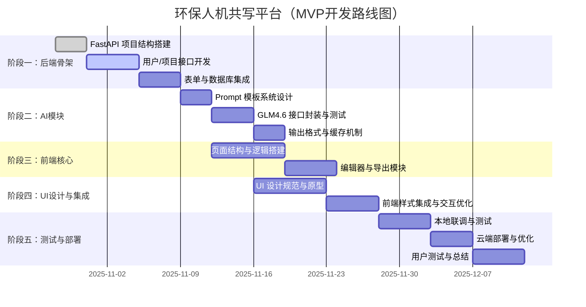

# 🌿 环保行业人机共写平台

## —— 项目架构与技术优化白皮书

### 文档版本

-   **版本号：** v1.0
    
-   **更新时间：** 2025-10-30
    
-   **适用阶段：** MVP（应急预案模块）
    
-   **作者：** 杨开迪
    

---

## 一、项目概述

本项目旨在打造一个 **AI 驱动的环保文书生成与编辑平台**，服务于环保服务领域的企业、机构与顾问，重点聚焦 **应急预案** 与 **环评报告** 两大类文档。

### 当前目标（MVP 阶段）

-   仅实现「应急预案」模块；
    
-   环评模块仅保留架构接口；
    
-   实现从企业信息输入 → AI生成 → 编辑 → 导出的完整流程；
    
-   支持本地运行和后期接入腾讯云 CloudBase。
    

---

## 二、系统总体架构设计

### 架构模型：三层一中台

```markdown
┌───────────────────────────┐
│        前端层（Web UI）     │
│ React + Next.js + Tailwind │
└────────────┬───────────────┘
             │ RESTful API
┌────────────┴───────────────┐
│       后端逻辑层（API服务） │
│ FastAPI + LangChain + GLM4.6│
└────────────┬───────────────┘
             │ SQLAlchemy ORM
┌────────────┴───────────────┐
│       数据与文件存储层      │
│ MySQL / SQLite + COS/本地目录│
└────────────┬───────────────┘
             │
┌────────────┴───────────────┐
│         AI 中台层           │
│ Prompt 模板 + 模型封装 + 缓存 │
└───────────────────────────┘
```

---

## 三、模块划分

| 模块 | 功能 | 技术栈 | 状态 |
| --- | --- | --- | --- |
| 用户模块 | 注册、登录、权限 | FastAPI + JWT | ✅ MVP中 |
| 项目管理 | 创建/删除/查询预案项目 | FastAPI + SQLAlchemy | ✅ MVP中 |
| 表单模块 | 企业信息填写与存储 | React + JSONSchema | ✅ MVP中 |
| AI 生成模块 | 调用 GLM4.6 生成文档 | FastAPI + LangChain | ✅ MVP中 |
| 编辑器模块 | 富文本/Markdown编辑 | TipTap / Editor.js | ✅ MVP中 |
| 导出模块 | 导出为 PDF/Word | ReportLab / python-docx | ✅ MVP中 |
| 环评模块 | 环评模板与生成逻辑 | 预留结构 | ⏳ 待实现 |

---

## 四、技术栈选型理由

| 层级 | 选型 | 原因 |
| --- | --- | --- |
| 前端 | Next.js + Tailwind | 组件化、SSR、快速成型 |
| 后端 | FastAPI | 高性能、类型安全、易与AI接口结合 |
| 数据库 | MySQL（生产） / SQLite（本地） | 平滑迁移、低配置依赖 |
| 模型 | 智谱 GLM4.6 + LangChain 封装 | 强语言理解力、支持结构化输出 |
| 文件存储 | 腾讯云 COS / 本地output目录 | 灵活部署、易于备份 |
| 状态管理 | Zustand / Redux | 轻量且可持久化 |
| 缓存 | Redis / fakeredis | 提升性能、任务队列支持 |

---

## 五、项目开发流程建议

| 阶段 | 主要工作 | 负责人 | 输出 |
| --- | --- | --- | --- |
| 阶段1 | 后端逻辑骨架搭建 | GLM + 架构师 | FastAPI骨架 + API文档 |
| 阶段2 | 本地联调与Mock测试 | 工程师 | 可运行MVP Demo |
| 阶段3 | UI原型设计与交互定义 | 设计师 | Figma原型 + 流程图 |
| 阶段4 | 前端实现与API绑定 | GLM + 前端 | 前端交互逻辑 |
| 阶段5 | 云端集成与优化 | 工程师 | CloudBase部署 |
| 阶段6 | 用户测试与反馈 | 团队 | 可复用模板与报告 |

---

## 六、AI 生成逻辑优化建议

### 1\. 模板分层机制

将八股文部分结构化为 Jinja2 模板，例如：

```csharp
templates/
├── base.j2
├── emergency/
│   ├── general.j2
│   ├── organization.j2
│   └── response.j2
```

GLM 只生成变量内容，避免重复浪费 Token。

---

### 2\. 结构化输出协议（标准化AI结果）

所有 AI 输出统一为以下格式：

```json
{
  "title": "突发环境事件应急预案",
  "sections": [
    {"chapter": "1. 总则", "content": "..."},
    {"chapter": "2. 应急组织机构", "content": "..."}
  ]
}
```

优点：

-   结构清晰；
    
-   前端可按章节渲染；
    
-   后续可复用章节编辑。
    

---

### 3\. Prompt 中台设计

在 `/prompts/registry.yaml` 维护统一管理：

```yaml
emergency_plan:
  description: 应急预案文档生成
  model: glm-4-0520
  template: templates/emergency/general.j2
  input_schema: schemas/emergency_input.json
```

---

### 4\. 模型缓存策略

-   使用 Redis 缓存上次生成的内容；
    
-   对相同输入直接复用；
    
-   异步生成大文档（Celery + Redis）。
    

---

## 七、前端与交互优化建议

### 1\. 用户核心路径

```
登录 → 项目列表 → 新建项目 → 填表 → 生成预案 → 编辑 → 导出
```

重点优化：

-   加载体验（进度条 / 骨架屏）
    
-   AI输出延迟处理（流式输出）
    
-   自动保存（debounce + localStorage）
    

---

### 2\. UI设计系统建议

**颜色体系**

-   主色：绿色系（环保调性）
    
-   状态色：红（错误）/ 黄（警告）/ 蓝（信息）
    

**组件体系**

-   输入框、按钮、卡片、导航栏统一风格；
    
-   Tailwind 主题变量命名：`--primary-green`, `--neutral-bg`。
    

---

### 3\. 编辑器体验优化

-   自动保存间隔：3s
    
-   支持快捷指令（如 `/改写`, `/扩写`）
    
-   支持 AI 助写接口（单段落重写）
    

---

## 八、工程与部署优化

### 1\. 版本控制

使用 Git 分支策略：

```css
main       → 生产稳定版  
dev        → 开发测试版  
feature/*  → 模块功能开发
```

### 2\. 自动化测试

-   Pytest 单元测试
    
-   Vitest 前端测试
    
-   Mock AI 响应测试
    

### 3\. CI/CD 自动部署

GitHub Actions：

-   后端测试 → 打包 Docker → 推送腾讯云；
    
-   前端打包 → 自动部署 CloudBase。
    

---

## 九、数据与安全策略

| 层级 | 策略 |
| --- | --- |
| 用户数据 | JWT加密、HTTPS通信 |
| AI输入数据 | 屏蔽敏感字段（手机号、法人姓名） |
| 数据存储 | 分表存储、日志审计 |
| 隐私保护 | 用户数据与AI训练数据隔离 |
| 法规合规 | 符合《网络安全法》《数据安全法》 |

---

## 十、未来扩展方向（环评模块）

1.  引入环评模板库；
    
2.  支持模型自动匹配行业规范；
    
3.  AI 审查模块（自动识别不合规表述）；
    
4.  向量数据库（知识增强生成 RAG）；
    
5.  企业数据沉淀 → 模型微调 → 精准生成。
    

---

## 十一、MVP 验收标准

| 检验项 | 验收标准 |
| --- | --- |
| 生成流程 | 从表单到文档生成全流程可跑通 |
| 数据存储 | 项目、表单、文档可持久化 |
| 编辑器 | 支持 AI 辅助写作与导出 |
| 前端交互 | 响应迅速，交互无明显卡顿 |
| 安全性 | 登录认证、数据加密通过测试 |

---

## 十二、结语

> 本项目是一款以“AI人机共写”为核心的环保文书工具。  
> 技术路线选择了「轻量后端 + 模板化生成 + 本地先行 + 云端扩展」的策略，  
> 能够让 MVP 快速落地，并具备长期演进的 SaaS 能力。

未来，当应急预案模块稳定后，环评模块的接入与知识库构建  
将使该产品成为**中国环保服务行业的标准化智能文书平台**。

---

📘 **附录**

-   环保应急预案法规参考标准（GB/T 29639-2020）
    
-   行业关键词库（供 Prompt 模型优化使用）
    
-   前端设计样式库规范（Figma Tokens）
    
# 🗂️ 附录二：MVP 阶段任务分解与路线图

## 一、总体说明

**项目目标：**  
完成应急预案模块的 MVP 版本，实现从企业信息输入 → AI 自动生成 → 编辑器修改 → 导出文档的完整闭环。

**预期周期：** 约 8–10 周  
**开发模式：** Agile（每阶段可迭代）  
**核心任务：** 后端逻辑构建 → 前端交互实现 → UI 集成 → 云部署。

---

## 二、任务分解表（WBS）

| 模块 | 子任务 | 说明 | 负责人 | 预计周期 |
| --- | --- | --- | --- | --- |
| **1\. 后端基础骨架** | 项目初始化 | 创建 FastAPI 项目结构、配置环境 | GLM | 2 天 |
|  | 用户系统 | 登录注册、JWT 验证、用户表结构 | GLM | 2 天 |
|  | 项目管理接口 | 创建、读取、删除项目API | GLM | 3 天 |
|  | 表单数据存储 | 接收企业信息、存储 JSON | GLM | 2 天 |
|  | 数据库集成 | SQLite（本地）/ MySQL（云） | GLM | 2 天 |
| **2\. AI 模块逻辑层** | Prompt 模板系统 | 设计模板文件结构 + 渲染逻辑 | GLM + 架构师 | 3 天 |
|  | AI 生成接口 | 调用智谱 GLM4.6 API | GLM | 3 天 |
|  | 输出标准化 | JSON → Markdown 格式化 | GLM | 2 天 |
|  | 模型缓存机制 | Redis/FakeRedis 缓存生成结果 | GLM | 2 天 |
| **3\. 前端核心功能** | 项目列表页 | 列表渲染 + 状态展示 | 前端 | 3 天 |
|  | 新建项目页 | 表单输入组件化 + 验证 | 前端 | 3 天 |
|  | AI 生成页 | 调用后端接口 + 加载动画 | 前端 | 4 天 |
|  | 编辑器页 | TipTap / Editor.js 集成 | 前端 | 5 天 |
|  | 导出模块 | PDF/Word 导出功能 | 前端 | 2 天 |
| **4\. UI/UX 设计阶段** | 设计规范制定 | 颜色、字体、组件风格 | 设计师 | 3 天 |
|  | 高保真原型 | 登录、项目、编辑器页设计 | 设计师 | 5 天 |
|  | 交互文档 | 按钮逻辑、页面跳转说明 | 设计师 | 2 天 |
| **5\. 集成与测试阶段** | 前后端联调 | 接口验证 + 状态联动 | 全体 | 5 天 |
|  | 异常处理 | 错误状态与提示信息完善 | 前端 | 3 天 |
|  | 本地测试 | MVP 功能端到端测试 | 架构师 | 3 天 |
|  | 云端部署 | MySQL + COS 集成测试 | 架构师 | 3 天 |
|  | 性能优化 | 缓存 + 并发优化 | 架构师 | 3 天 |
| **6\. 产品验证与总结** | 用户体验测试 | 内部试用、Bug 记录 | 全体 | 3 天 |
|  | 文档与培训 | 接口说明、使用文档 | GLM + 架构师 | 2 天 |
|  | 复盘与下一阶段规划 | 环评模块需求分析 | 创始人 | 2 天 |

---

## 三、开发优先级（P0–P2 分级）

| 优先级 | 定义 | 模块示例 |
| --- | --- | --- |
| **P0（必须完成）** | MVP 必备功能，保证产品能完整运行 | 用户系统、项目管理、AI生成、编辑器、导出 |
| **P1（重要优化）** | 影响体验但可延后 | 自动保存、版本控制、进度条动画 |
| **P2（增强体验）** | 增值功能，可在下一阶段加入 | 模型缓存优化、AI段落改写、协作功能 |

---

## 四、阶段路线图（Gantt 结构）



---

## 五、任务管理与协作建议

### 工具推荐

| 需求 | 工具 | 说明 |
| --- | --- | --- |
| 任务协作 | Trello / Notion | 支持任务看板与状态流转 |
| 代码托管 | GitHub / Gitee | 使用分支策略（main/dev/feature） |
| 原型设计 | Figma / Google Stitch | 输出设计稿和交互说明 |
| 接口管理 | Swagger / Postman | 调试后端接口 |
| 文档协作 | Notion / Confluence | 存放白皮书与开发规范 |

### Sprint 建议（两周一轮）

-   **第1轮：** 后端基础 + AI逻辑通路；
    
-   **第2轮：** 前端结构 + 页面交互；
    
-   **第3轮：** 联调 + 优化 + 部署。
    

---

## 六、风险与预案

| 风险点 | 可能问题 | 应对措施 |
| --- | --- | --- |
| AI 接口不稳定 | 网络或模型延迟 | 增加重试逻辑 / 缓存结果 |
| 模型生成不规范 | 文档结构混乱 | 强制输出 JSON + 模板约束 |
| 前后端字段错配 | 请求失败或空白页 | 统一 OpenAPI Schema |
| UI/逻辑分离困难 | 二次开发复杂 | 采用组件化开发 + 明确数据接口 |
| 云数据库迁移风险 | 权限或连接问题 | 本地测试 → 云端迁移脚本 |
| 产品进度拖延 | 依赖交付延误 | 阶段验收 + 看板透明化 |

---

## 七、验收节点（Milestones）

| 阶段 | 验收内容 | 验收标准 | 时间节点 |
| --- | --- | --- | --- |
| **里程碑1** | 后端骨架可运行 | 所有API可返回正确响应 | 第2周 |
| **里程碑2** | AI生成逻辑打通 | 输入表单 → 输出预案成功 | 第4周 |
| **里程碑3** | 前端编辑器联通 | 编辑器可修改AI生成文本 | 第6周 |
| **里程碑4** | UI集成与云部署 | 可访问云端Demo | 第8周 |
| **里程碑5** | MVP 验收完成 | 满足功能闭环、可展示 | 第10周 |

---

## 八、总结与下一阶段展望

当 MVP 阶段全部完成后，将进入：

-   「环评模块」开发；
    
-   「AI审查与合规检测」增强；
    
-   「多企业多租户」SaaS 架构扩展；
    
-   构建数据飞轮，实现模型自动优化。
    

> ✅ 本路线图的核心目标：  
> **以最小成本验证产品可行性，同时确保架构具备长期可扩展性。**

